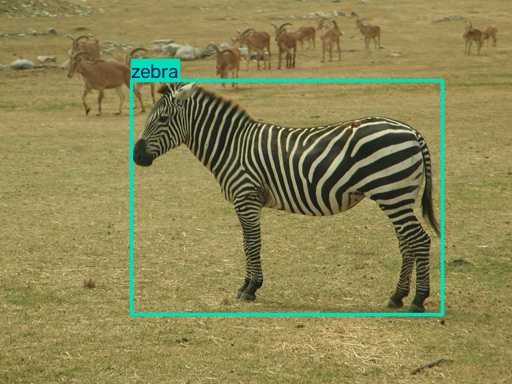
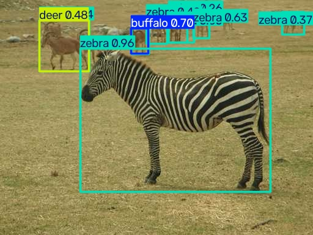
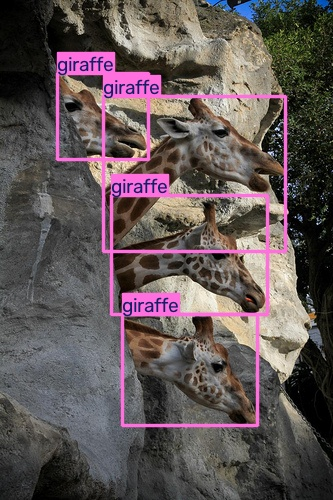
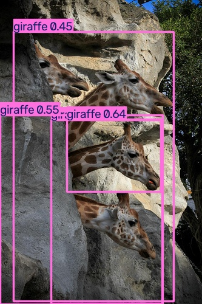

# 失败分析：从真实预测中检查问题

分析对象为原八类 416 基线，不混入新增模型结果。使用已保存的全部 360 张测试图片匹配记录；不是只统计展示图片。

规则：预测 conf≥0.25，按置信度从高到低，对同类别标注做一对一贪心匹配，IoU≥0.5 为匹配成功。该规则用于解释错误，不等同于官方 AP 计算，也不等同于测试 JSON 中自动汇总的 P/R。

| 来源 | 图片 | 标注框 | 预测框 | 匹配成功 | 未匹配预测 | 未匹配标注 |
|---|---:|---:|---:|---:|---:|---:|
| 全部测试图 | 360 | 577 | 636 | 509 | 127 | 68 |
| African Wildlife | 211 | 352 | 399 | 332 | 67 | 20 |
| COCO val2017 | 80 | 133 | 140 | 101 | 39 | 32 |
| Open Images（自定义划分） | 69 | 92 | 97 | 76 | 21 | 16 |

“未匹配预测”可能包括误检、重复框、位置偏差或数据漏标；“未匹配标注”可能来自漏检、类别错误或定位偏差。因此不能把这两列都直接解释成视觉上多认/少认了多少只动物。各来源的动物类别、图片难度不同，不能直接把分组差异当作数据来源的因果作用。

## 样例一：背景动物、类别范围与额外预测

african_4 (200).jpg 的原始标注只有 1 个斑马框；基线预测 10 个框，按匹配规则有 1 个成功、9 个未匹配预测。模型在背景动物附近给出了鹿、水牛或斑马等标签。背景存在动物，不代表这些类别预测正确，也不能仅凭这点就宣布数据漏标。

应逐个核对背景动物是否属于约定的八类，以及框和类别是否正确：如果属于目标类却没有标注，才是目标漏标问题；若属于八类之外或预测类别错误，额外预测仍属于误检。当前未完成人工物种与框的逐项复核，保留9个未匹配预测的统计，不替模型排除错误。

## 样例二：检测到类别，但框的位置不匹配

coco_val2017_000000286849.jpg 中标注 4 个长颈鹿目标，模型也输出 4 个框，但只有 1 个满足同类 IoU≥0.5 匹配条件。3 个预测框与3个标注框未匹配。可见“数量一样”不代表检测正确。

图片中长颈鹿彼此重叠，部分躯体被岩石遮挡；预测框与标注框的覆盖范围明显不同。这里直接观察到的是定位不一致。遮挡可能有影响，但仅凭这张图不能证明遮挡是唯一原因，也不能把3个未匹配标注简单解释为完全没有识别到3只动物。

