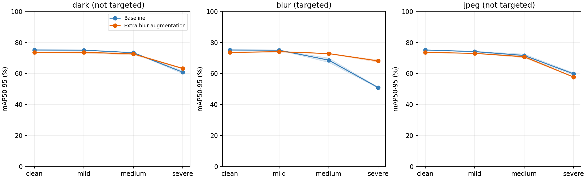
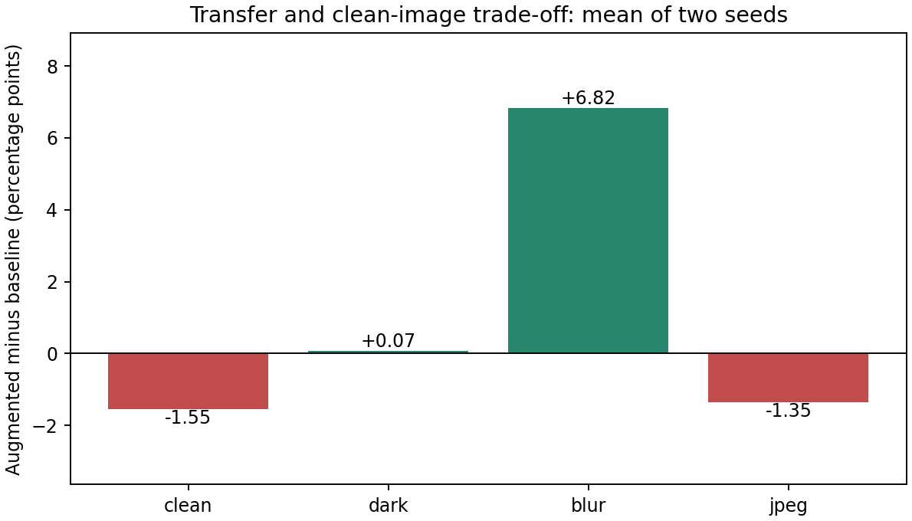
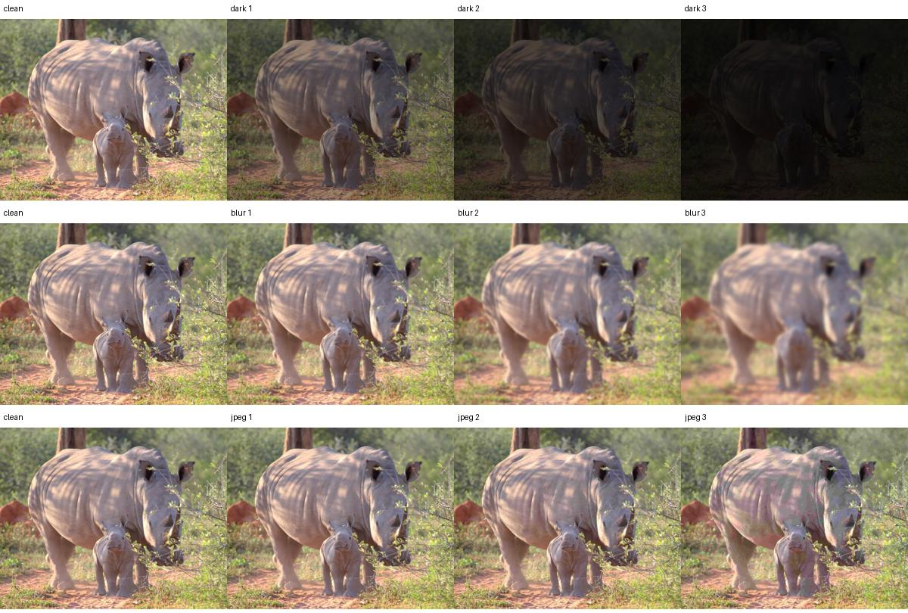

# 单一退化增强的迁移能力与代价

本实验沿用八类YOLOv8n项目，研究“只额外强化一种图像退化，能否改善其他退化，并保持清晰图效果”。不是新网络，也不是AugMix的完整复现。全部结果来自本机真实训练与评估。

## 实验结论（由实际数据生成）

验证集按预先固定规则选中 **blur** 作为额外增强类型。下面的数值为两个随机种子的平均结果；括号中列出各自变化，防止均值掩盖不稳定。

| 测试条件 | 基线mAP50–95 | 增强模型mAP50–95 | 平均变化/百分点 | seed42变化 | seed43变化 |
|---|---:|---:|---:|---:|---:|
| clean | 75.11% | 73.55% | -1.55 | -1.39 | -1.72 |
| dark | 69.71% | 69.78% | +0.07 | +0.54 | -0.40 |
| blur | 64.80% | 71.62% | +6.82 | +7.33 | +6.31 |
| jpeg | 68.48% | 67.12% | -1.35 | -1.29 | -1.41 |

- clean：平均变化-1.55个百分点；两个种子同方向。

- dark：平均变化+0.07个百分点；两个种子不同方向或包含零变化。

- blur：平均变化+6.82个百分点；两个种子同方向。

- jpeg：平均变化-1.35个百分点；两个种子同方向。

退化条件一行是轻/中/重三个等级先平均，再对两个种子平均；clean一行只计算清晰图。平均提升不意味着所有等级或所有动物都提升。只有两个种子，不宣称统计显著。


曲线为两种子均值，阴影是两次结果的最小到最大范围，不是置信区间。



## 怎样设计这个实验

1. 数据固定：1753张训练、383张验证、360张测试，类别与标注沿用原实验。
2. 在运行前写入protocol.json，规定三种退化及各三个强度，所有条件保留原图尺寸和检测框。
3. 只用seed42原基线的验证集mAP50–95，在三种退化的平均成绩中选择最低的一种。强度没有做跨退化的感知等价校准，因此“最低”只相对于这套预设强度。
4. 对训练集固定随机打乱后的一半图片（876张）施加选中退化，轻/中/重各292张；另外877张保持原像素。没有新增重复样本，总训练图片仍为1753张。两种子共享同一份增强数据，以隔离训练随机性的变化。
5. 增强图片以PNG保存，保持尺寸；原标签逐字节复制。其余PNG经解码像素一致性检查，与原JPEG解码结果完全一致。退化不是裁剪或移动目标，所以不修改框。
6. 原模型保留HSV、Mosaic等默认训练增强；新方案是在其基础上额外强化一种退化。因此称为“未针对强化的退化”，不称为“训练中从未见过的退化”。本机未安装Albumentations。
7. 复用已经完成的seed42基线，新增增强seed42、基线seed43、增强seed43，各30轮。均从同一COCO初始权重开始，不在旧best.pt上接着训练。
8. 两组都按原清晰验证集表现选best.pt；完成训练后再统一评估清晰及九种退化测试集，没有用测试结果再选增强或训练轮数。

## 固定参数与退化定义

| 项目 | 数值 |
|---|---|
| 训练 | YOLOv8n、30轮、416、batch8、AdamW、lr0=.001、weight_decay=.0005 |
| 其余训练设置 | amp=False、workers=WORKERS、deterministic=True、mosaic=1、close_mosaic=0、patience=31 |
| 变暗 | BGR像素乘0.6 / 0.3 / 0.12并截断到uint8；不是夜视相机模拟 |
| 模糊 | 高斯sigma=图像短边×0.0015 / 0.004 / 0.008，反射边界；不是运动模糊 |
| 压缩 | OpenCV JPEG质量60 / 25 / 8，解码后存PNG；不是重复压缩多轮 |
| 评估 | 官方Ultralytics AP；imgsz416、batch1、conf=.001、NMS IoU=.7，主指标mAP50–95 |
| 随机种子 | 训练42、43；增强样本分配20261004 |



**本轮主指标是官方mAP，与之前conf=0.5实验的固定阈值micro P/R/F1口径不同。不能把两份报告数值混用。**

## 每个等级的原始结果

| 条件 | 基线42 | 增强42 | 基线43 | 增强43 | 平均变化/百分点 |
|---|---:|---:|---:|---:|---:|
| clean | 75.21% | 73.82% | 75.00% | 73.28% | -1.55 |
| dark1 | 75.16% | 74.06% | 74.84% | 73.13% | -1.41 |
| dark2 | 73.38% | 73.09% | 73.37% | 72.05% | -0.80 |
| dark3 | 59.83% | 62.84% | 61.70% | 63.52% | +2.42 |
| blur1 | 74.89% | 74.23% | 75.05% | 73.82% | -0.95 |
| blur2 | 67.12% | 72.96% | 69.98% | 72.64% | +4.25 |
| blur3 | 50.55% | 67.37% | 51.24% | 68.73% | +17.16 |
| jpeg1 | 74.34% | 72.95% | 73.84% | 72.93% | -1.15 |
| jpeg2 | 72.59% | 71.33% | 70.61% | 70.19% | -0.84 |
| jpeg3 | 59.10% | 57.87% | 60.39% | 57.48% | -2.07 |

## 训练成本与证据

| 新训练 | 完成轮数 | 训练分钟 | PyTorch峰值分配显存/MiB |
|---|---:|---:|---:|
| augmented42 | 30 | 32.78 | 768 |
| baseline43 | 30 | 22.92 | 773 |
| augmented43 | 30 | 33.31 | 773 |

训练时间受运行负载与PNG解码开销影响，不作为纯算法效率结论；显存为PyTorch分配峰值，不是整机GPU占用。seed42旧基线未记录同口径峰值，不补造。

## 如何自己重跑与核查

```powershell
# 在自己的项目根目录运行
$projectPython = '.\.venv\Scripts\python.exe'
& $projectPython -X utf8 scripts/run_robustness.py
& $projectPython -X utf8 scripts/summarize_robustness.py
```

入口默认保留已完成实验并跳过，已有结果时不代表重新训练。中断的训练目录会报错而不会悄悄覆盖。新增训练从assets/yolov8n.pt启动；不要删除原数据或已有结果来强行重跑。
要独立重跑，指定一个新的输出目录（仍复用已有seed42参考基线，并重新完成三次训练和全部评估）：

```powershell
& $projectPython -X utf8 scripts/run_robustness.py --output wildlife8/robustness_my_run
& $projectPython -X utf8 scripts/summarize_robustness.py --output wildlife8/robustness_my_run
```

- `protocol.json`：先于结果写入的方案；`selected_corruption.json`：验证集选择记录。
- `augmented_data/manifest.json`：每张训练图是否变化、强度、图片与标签哈希。
- `training/*/train/results.csv`与`weights/best.pt`：三次新训练逐轮记录与权重。
- `metrics/*/test/*.json`：四个模型×十种测试条件，含每类指标。
- `paired_seed_comparison.csv`与`transfer_summary.csv`：成对结果与类别退化汇总。
- `per_class_metrics.csv`：四个模型、十种条件下八类动物各自的指标。
- `pipeline.log`、三份训练日志及record.json：执行记录、环境和模型哈希。

## 可以怎样讲、不能怎样讲

可以讲：先验证检测器对预设图像退化的敏感性，再选择一种退化进行有限成本的增强训练，比较对目标退化、其他退化及清晰图的收益与损失，且检查两个随机种子的结果。
不能讲：提出了新的YOLO结构；完整复现了AugMix；在真实夜间/恶劣天气必然有效；只有两次运行就证明统计显著；原测试集是从未看过的新盲测。
本研究借鉴已有鲁棒性评估和增强思路，贡献是课程任务上的可复现实验、对照与失败分析。原标注潜在误差、数据来源差异以及此前测试集已被查看，仍然是局限。

参考：[Michaelis等，目标检测鲁棒性评估](https://arxiv.org/abs/1907.07484)；[AugMix（分类任务上的增强方法，非本项目所实现算法）](https://arxiv.org/abs/1912.02781)。
